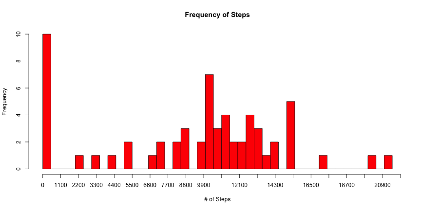
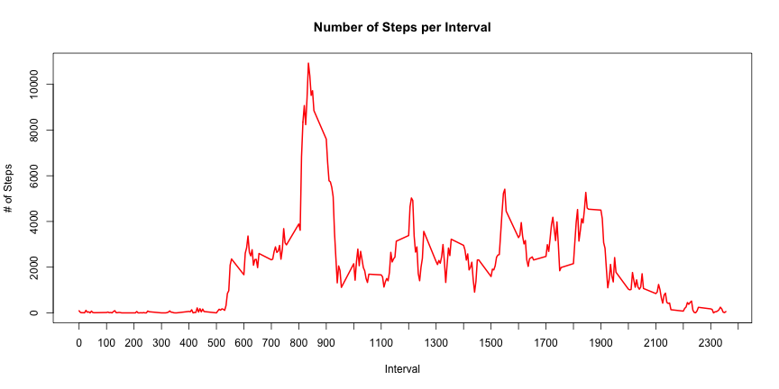
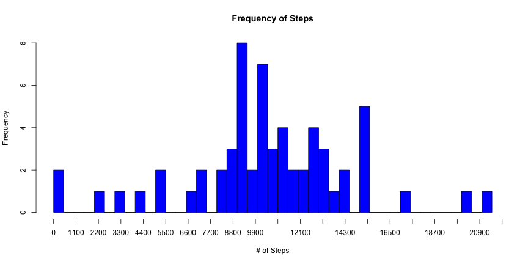
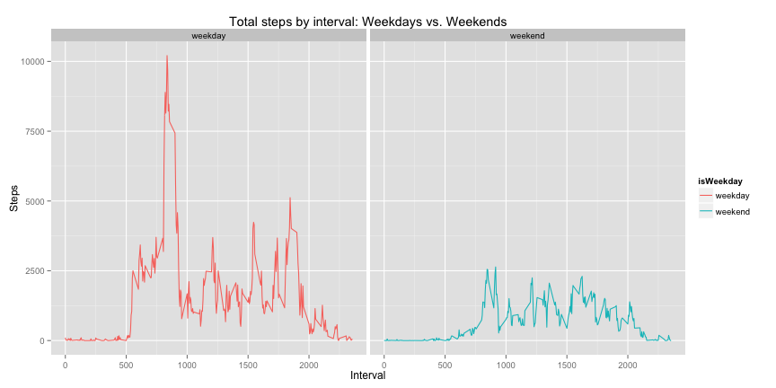

# Reproducible Research Peer Assignment 1
## By Andrew Burke

Please see each section below for a description of the approach to each task.

### Loading and preprocessing the data
Most processing was done for the individual tasks listed below.  The following code simply loads the original data and converts the dates to a usable type.

Note that the dplyr and ggplot2 packages are required for the execution of any code below.


```r
require("dplyr")
require("ggplot2")
original <- read.csv("activity.csv", stringsAsFactors=FALSE, na.string="NA")
original$date <- as.Date(original$date)
```


### What is mean total number of steps taken per day?
To answer this question, the data is first filtered into a new data frame, totalsPerDay, with two variables: the date and the total number of steps taken on that date.  This number is found by looping through each unique date and extracting only the data matching that date from the original set.  We then sum the number of steps in this subset and add it to the correct row of totalsPerDay.  Finally, the histogram is plotted with a custom axis and the mean and median calculated.

For the purposes of computation, all NA's are replaced with zeroes for this task.


```r
#Task 1: Calculate mean and median number of steps by day.
totalsPerDay <- as.data.frame(as.Date(unique(original$date)))
colnames(totalsPerDay) <- c("date")

for(x in totalsPerDay$date)
{
  subset <- filter(original, date==x)
  subset$steps[is.na(subset$steps)] <- 0
  totalsPerDay[totalsPerDay$date==x,2] <- sum(subset$steps)
}
colnames(totalsPerDay)[2] <- "steps"

hist(totalsPerDay$steps, breaks=nrow(totalsPerDay), col="red", main="Frequency of Steps", xlab="# of Steps", ylab="Frequency", xaxt="n")
maxX <- 1000 * (max(totalsPerDay$steps)%/%1000 + as.logical(max(totalsPerDay$steps)%%1000))
axis(1, at=seq(0, as.integer(maxX), by=maxX/20))
```

 

```r
print(paste("Mean number of steps per day:", as.integer(mean(totalsPerDay$steps))))
```

```
## [1] "Mean number of steps per day: 9354"
```

```r
print(paste("Median number of steps per day:", as.integer(median(totalsPerDay$steps))))
```

```
## [1] "Median number of steps per day: 10395"
```


### What is the average daily activity pattern?
To answer this question, the data are filtered into a new data set, totalsPerInterval.  This set contains a row for each 5-minute interval in the original data set.  The original data are then filtered out by interval and the sum of the steps in the resulting subset is computed and entered into totalsPerInterval.  Finally, the line plot is drawn with a custom x axis and the most active interval computed and reported.

For the purposes of computation, all NA's are replaced with zeroes for this task.


```r
#Task 2: Explore average daily activity pattern.
totalsPerInterval <- as.data.frame(unique(original$interval))
colnames(totalsPerInterval) <- c("interval")

for(x in totalsPerInterval$interval)
{
  subset <- filter(original, interval==x)
  subset$steps[is.na(subset$steps)] <- 0
  totalsPerInterval[totalsPerInterval$interval==x,2] <- sum(subset$steps)
}
colnames(totalsPerInterval)[2] <- "steps"

plot(x=totalsPerInterval$interval, y=totalsPerInterval$steps, type="l", xaxt="n", col="red", main="Number of Steps per Interval", xlab="Interval", lwd=2, ylab="# of Steps", xaxt="n")
maxX <- 1000 * (max(totalsPerInterval$interval)%/%1000 + as.logical(max(totalsPerInterval$interval)%%1000))
axis(1, at=seq(0, as.integer(maxX), by=maxX/30))
```

 

```r
maxSteps <- max(totalsPerInterval$steps)
print(paste("Max number of steps occurs at interval:", totalsPerInterval[totalsPerInterval$steps==maxSteps,1]))
```

```
## [1] "Max number of steps occurs at interval: 835"
```


### Imputing missing values
We begin this task by calculating the number of NA values.  Then, we calculate replacement values by finding the average number of steps taken for each interval.  This is done by reusing the dataset from the previous task, totalsPerInterval.  A new variable, average, is added to this dataset, and is calculated by dividing the number of steps per interval by the number of dates.  We then make a copy of the original dataset and name it cleaner.  We look through the cleaner dataset, and any occurrences of NA are replaced by the matching average value in totalsPerInterval.  The results are then plotted using a histogram.


```r
#Task 3: Imputing missing values.  
#Replacement strategy is the mean for each 5 minute interval.
print(paste("Total NA's:",sum(is.na(original$steps))))
```

```
## [1] "Total NA's: 2304"
```

```r
totalsPerInterval[,3] <- totalsPerInterval[,2]/length(unique(original$date))
colnames(totalsPerInterval)[3] <- "average"
cleaner <- original
 
for(x in 1:nrow(cleaner))
{
  if(is.na(cleaner[x,1]))
    cleaner[x,1] <- ceiling(totalsPerInterval[totalsPerInterval$interval == cleaner[x,3],3])
}

totalsPerDay <- as.data.frame(as.Date(unique(cleaner$date)))
colnames(totalsPerDay) <- c("date")

for(x in totalsPerDay$date)
{
  subset <- filter(cleaner, date==x)
  subset$steps[is.na(subset$steps)] <- 0
  totalsPerDay[totalsPerDay$date==x,2] <- sum(subset$steps)
}
colnames(totalsPerDay)[2] <- "steps"

hist(totalsPerDay$steps, breaks=nrow(totalsPerDay), col="blue", main="Frequency of Steps", xlab="# of Steps", ylab="Frequency", xaxt="n")
maxX <- 1000 * (max(totalsPerDay$steps)%/%1000 + as.logical(max(totalsPerDay$steps)%%1000))
axis(1, at=seq(0, as.integer(maxX), by=maxX/20))
```

 

```r
print(paste("Mean number of steps per day (with NA's removed):", as.integer(mean(totalsPerDay$steps))))
```

```
## [1] "Mean number of steps per day (with NA's removed): 10598"
```

```r
print(paste("Median number of steps per day (with NA's removed):", as.integer(median(totalsPerDay$steps))))
```

```
## [1] "Median number of steps per day (with NA's removed): 10395"
```

### Are there differences in activity patterns between weekdays and weekends?

To answer this question, a new variable is added to the dataset as completed in the previous step.  This variable is whether or not the date in question is a weekday or weekend.  Then, two subsets are computed: the weekdaySet, with all the data from weekdays, and weekendSet, with all the data from weekends.  In a similar fashion to task 2, the number of steps in each interval taken on weekdays and weekends is calculated.  These numbers are then bound into a final dataset, weekdaySummary.  The weekdaySummary dataset is then plotted using faceting on whether or not the data comes from a weekday or weekend.


```r
cleaner$isWeekday <- ifelse(weekdays(cleaner$date)=="Sunday" | weekdays(cleaner$date)=="Saturday", "weekend","weekday")

weekdaySet <- filter(cleaner, isWeekday=="weekday")
weekendSet <- filter(cleaner, isWeekday=="weekend")
weekdayTotal <- as.data.frame(unique(weekdaySet$interval))
colnames(weekdayTotal) <- c("interval")

for(x in weekdayTotal$interval)
{
  subset <- filter(weekdaySet, interval==x)
  weekdayTotal[weekdayTotal$interval==x,2] <- sum(subset$steps)
}
colnames(weekdayTotal)[2] <- "steps"
weekdayTotal[,3] <- rep("weekday", times=nrow(weekdayTotal))
colnames(weekdayTotal)[3] <- "isWeekday"

weekendTotal <- as.data.frame(unique(weekendSet$interval))
colnames(weekendTotal) <- c("interval")

for(x in weekendTotal$interval)
{
  subset <- filter(weekendSet, interval==x)
  weekendTotal[weekendTotal$interval==x,2] <- sum(subset$steps)
}
colnames(weekendTotal)[2] <- "steps"
weekendTotal[,3] <- rep("weekend", times=nrow(weekendTotal))
colnames(weekendTotal)[3] <- "isWeekday"

weekdaySummary <- rbind(weekdayTotal, weekendTotal)

p <- ggplot(weekdaySummary, aes(x=interval, y=steps, color=isWeekday)) + facet_grid(.~isWeekday) + xlab("Interval") +
  ylab("Steps") + ggtitle("Total steps by interval: Weekdays vs. Weekends") +
  geom_line()

print(p)
```

 

The result clearly demonstrates that the total steps on weekends are drastically lower than the total steps on weekdays.  We conclude that weekends are less active than weekdays.
